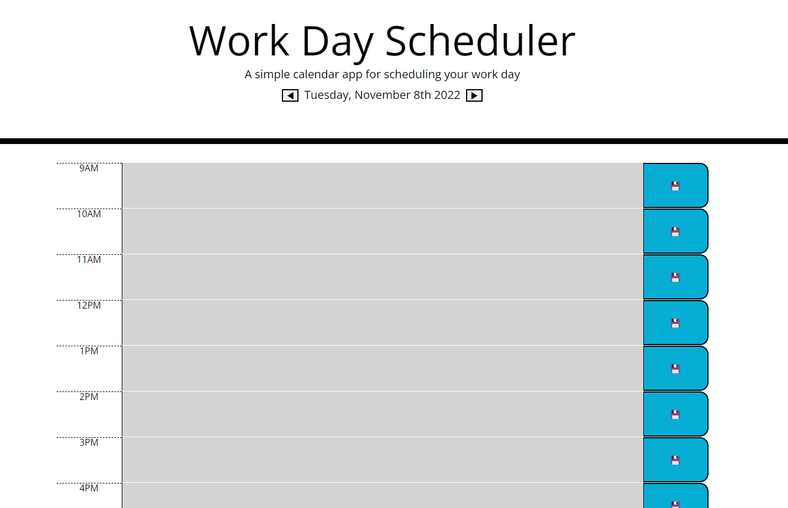

# Work Day Scheduler Starter Code

## Badges 

## Description
This is a planner for your work day! Add an event to any time and click save, then you can come back later to see each day's events!

## Built With
- HTML
- CSS
- Javascript
- JQuery
- Moment.js

## Installation

N/A

## Usage

Visit this web address to see the github deployed page for the repo https://cjmerit.github.io/Business-Planner/

This is an image of the deployed website:

Using chrome as the browser for the web page, right click on it and click inspect to use Chrome DevTools to inspect the html and CSS.